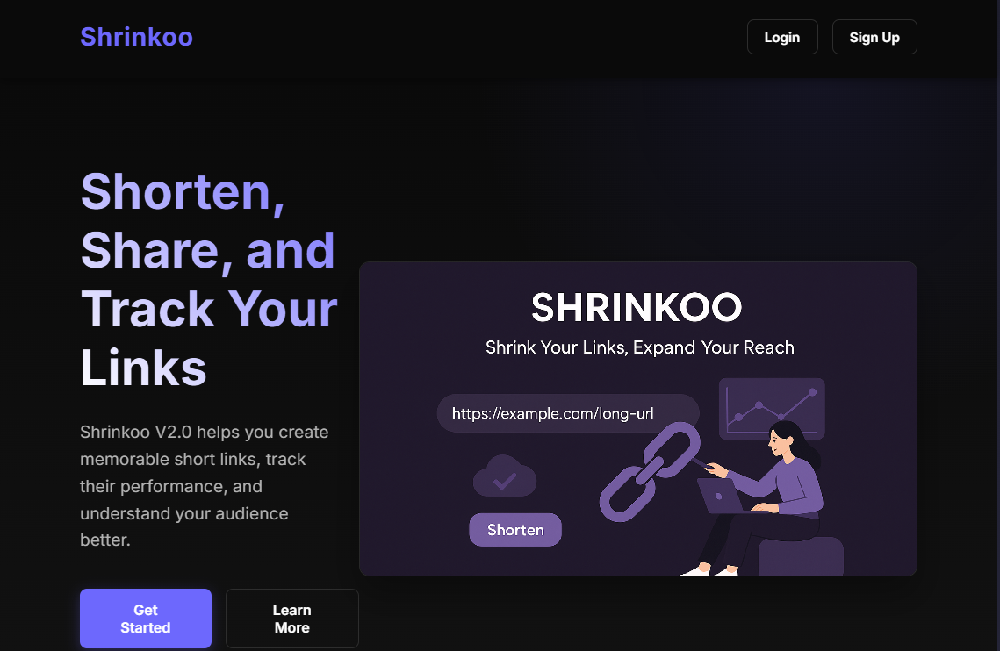

# 🔗 Shrinkoo - Modern URL Shortener

A full-stack URL shortening service with Firebase authentication, MongoDB storage, and automatic link expiration.



## ✨ Features

- **URL Shortening**: Convert long URLs into short, shareable links
- **Firebase Authentication**: Secure user sign-in/sign-up with Google OAuth
- **Auto-Expiring Links**: URLs automatically delete after 7 days using MongoDB TTL
- **Click Tracking**: View analytics and click counts for each shortened link
- **QR Code Generation**: Generate QR codes for easy mobile sharing
- **REST API**: Full programmatic access to all features
- **Responsive Design**: Optimized for desktop, tablet, and mobile devices
- **Real-time Updates**: Live click count updates and link management

## 🛠️ Tech Stack

| Component       | Technology                    |
|-----------------|-------------------------------|
| **Frontend**    | React 18 + REACT + TailwindCSS|
| **Backend**     | Node.js + Express.js          |
| **Database**    | MongoDB Atlas (Cloud)         |
| **Authentication** | Firebase Auth              |
| **Deployment** | Vercel (Frontend + Backend)    |
| **Styling**    | TailwindCSS + Headless UI     |

## 🚀 Quick Start

### Prerequisites

- Node.js v18+ and npm
- MongoDB Atlas account
- Firebase project with Auth enabled
- Vercel account (for deployment)

### 1. Clone & Install Dependencies

```bash
git clone https://github.com/SkorpionOP/Shrinkoo.git
cd Shrinkoo

# Install root dependencies
npm install

# Install frontend dependencies
cd frontend
npm install

# Install backend dependencies
cd ../backend
npm install
```

### 2. Environment Configuration

Create environment files in both frontend and backend directories:

**backend/.env**
```env
MONGO_URI=mongodb+srv://<username>:<password>@cluster.mongodb.net/shrinkoo?retryWrites=true&w=majority
FIREBASE_PROJECT_ID=your-firebase-project-id
BASE_URL=http://localhost:3000
PORT=5000
NODE_ENV=development
```

**frontend/.env**
```env
REACT_FIREBASE_API_KEY=your-firebase-api-key
REACT_FIREBASE_AUTH_DOMAIN=your-project.firebaseapp.com
REACT_FIREBASE_PROJECT_ID=your-firebase-project-id
REACT_API_BASE_URL=http://localhost:5000/api
```

### 3. Firebase Setup

1. Create a new Firebase project at [console.firebase.google.com](https://console.firebase.google.com)
2. Enable Authentication and configure sign-in methods
3. Get your Firebase config from Project Settings
4. Update the frontend environment variables

### 4. MongoDB Setup

1. Create a MongoDB Atlas cluster
2. Create a database user and get connection string
3. Whitelist your IP address
4. Update the `MONGO_URI` in backend/.env

### 5. Run Development Servers

```bash
# Terminal 1 - Backend server (from /backend directory)
cd backend
npm run dev

# Terminal 2 - Frontend server (from /frontend directory)  
cd frontend
npm run dev
```

The application will be available at:
- Frontend: http://localhost:3000
- Backend API: http://localhost:5000


## 🔧 API Documentation

### Base URL
```
https://shrinkoo.vercel.app/api
```

### Authentication
All protected routes require a Firebase JWT token in the Authorization header:
```
Authorization: Bearer <firebase-jwt-token>
```

### Endpoints

#### Shorten URL
```http
POST /api/urls/shorten
Content-Type: application/json
Authorization: Bearer <token>

{
  "originalUrl": "https://example.com/very-long-url"
}
```

**Response:**
```json
{
  "success": true,
  "data": {
    "shortUrl": "https://shrinkoo.vercel.app/abc123",
    "shortId": "abc123",
    "originalUrl": "https://example.com/very-long-url",
    "qrCode": "data:image/png;base64,iVBORw0KGgoAAAANSUhEUgAA...",
    "clickCount": 0,
    "createdAt": "2024-01-15T10:30:00.000Z",
    "expiresAt": "2024-01-22T10:30:00.000Z"
  }
}
```

#### Redirect to Original URL
```http
GET /:shortId
```
Redirects to the original URL and increments click count.

#### Get URL Analytics
```http
GET /api/urls/:shortId
Authorization: Bearer <token>
```

**Response:**
```json
{
  "success": true,
  "data": {
    "shortId": "abc123",
    "originalUrl": "https://example.com/very-long-url",
    "shortUrl": "https://shrinkoo.vercel.app/abc123",
    "clickCount": 42,
    "createdAt": "2024-01-15T10:30:00.000Z",
    "expiresAt": "2024-01-22T10:30:00.000Z"
  }
}
```

#### Get User's URLs
```http
GET /api/urls/user
Authorization: Bearer <token>
```

#### Delete URL
```http
DELETE /api/urls/:shortId
Authorization: Bearer <token>
```

## 🚀 Deployment

### Vercel Deployment

1. **Push to GitHub**
   ```bash
   git add .
   git commit -m "Initial commit"
   git push origin main
   ```

2. **Import to Vercel**
   - Go to [vercel.com](https://vercel.com)
   - Click "New Project"
   - Import your GitHub repository

3. **Configure Environment Variables**
   
   In Vercel dashboard, add these environment variables:
   
   **Backend Environment Variables:**
   - `MONGO_URI`
   - `FIREBASE_PROJECT_ID`
   - `BASE_URL` (your Vercel domain)
   
   **Frontend Environment Variables:**
   - `REACT_FIREBASE_API_KEY`
   - `REACT_FIREBASE_AUTH_DOMAIN`
   - `REACT_FIREBASE_PROJECT_ID`
   - `REACT_API_BASE_URL` (your Vercel API URL)

4. **Deploy**
   Vercel will automatically build and deploy your application.

[](https://vercel.com/new/clone?repository-url=https://github.com/SkorpionOP/Shrinkoo)

### Manual Deployment

For other platforms, build the frontend:

```bash
cd frontend
npm run build
```

The `dist` folder contains the production build.

## 🧪 Development

### Available Scripts

**Backend (from /backend):**
```bash
npm run dev      # Start development server with nodemon
npm start        # Start production server
```

**Frontend (from /frontend):**
```bash
npm run dev      # Start REACT development server
npm run build    # Build for production
npm run preview  # Preview production build
```

### Adding New Features

1. Backend changes go in `/backend`
2. Frontend changes go in `/frontend/src`
3. Update API documentation in this README
4. Test both development and production builds

## 🤝 Contributing

1. Fork the repository
2. Create a feature branch: `git checkout -b feature/amazing-feature`
3. Commit changes: `git commit -m 'Add amazing feature'`
4. Push to branch: `git push origin feature/amazing-feature`
5. Open a Pull Request

## 🐛 Issues & Support

- **Bug Reports**: [Create an issue](https://github.com/SkorpionOP/Shrinkoo/issues)
- **Feature Requests**: [Create an issue](https://github.com/SkorpionOP/Shrinkoo/issues)
- **Documentation**: Check this README or create an issue

## 📝 License

MIT License - see the [LICENSE](LICENSE) file for details.

## 🙏 Acknowledgments

- Firebase for authentication services
- MongoDB Atlas for cloud database
- Vercel for seamless deployment
- TailwindCSS for beautiful styling

---

**Made with ❤️ by [SkorpionOP](https://github.com/SkorpionOP)**

⭐ Star this repo if you found it helpful!
